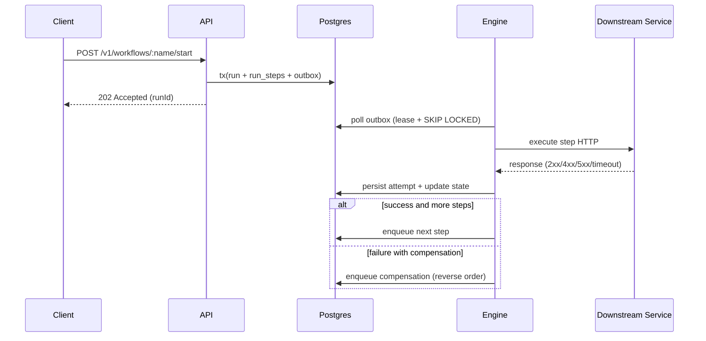

# SagaFlow

SagaFlow es un **Distributed Workflow / Saga Orchestrator** backend-only en Node.js + TypeScript.
Coordina workflows multi-paso entre servicios HTTP, con persistencia total en Postgres, retries seguros, compensaciones, idempotencia por step y observabilidad integral.

## Qué resuelve

Ejecuta flujos como:

`crear pedido -> cobrar -> reservar inventario -> notificar`

Si un paso falla, SagaFlow aplica compensaciones en orden inverso para mantener consistencia (`refund`, `release inventory`, etc.).

## Stack

- Node.js 20+
- TypeScript
- Fastify (API y mocks)
- PostgreSQL (estado crítico)
- Redis (rate limiting admin)
- Pino (logs)
- OpenTelemetry (tracing)
- Prometheus `/metrics`
- Vitest (unit + integration)
- Docker Compose
- GitHub Actions (CI)

## Arquitectura

```text
Client
  |
  v
[API Fastify] --(tx)--> [Postgres: runs/steps/outbox]
  |                              ^
  |                              |
  +------------------------------+
                                 |
                            polling + lease
                                 |
                            [Engine Worker]
                                 |
           +---------------------+----------------------+
           |                     |                      |
      [payments]            [inventory]          [notifications]
```

El engine corre como servicio separado (`apps/engine`) y procesa la outbox de forma asíncrona.

### Diagrama de secuencia



### Principios clave

- No in-memory state crítico.
- Outbox pattern para ejecución asíncrona resiliente.
- `FOR UPDATE SKIP LOCKED` + leasing para múltiples instancias del engine.
- Idempotencia por step vía `X-Idempotency-Key`.
- Reintentos con backoff exponencial + jitter.
- Compensaciones en orden inverso.

## Delivery semantics

- Step execution: at-least-once.
- Compensation execution: at-least-once.
- Run state transitions: exactly-once per transition (transactional update in Postgres).

## Failure model

SagaFlow está diseñado para fallas parciales y recuperación automática:

- Si el engine se cae durante un step:
  - la fila de outbox queda `IN_FLIGHT` con lease.
  - al expirar el lease, otro worker la retoma.
  - la idempotencia por step evita efectos duplicados.
- Si Postgres se reinicia:
  - API y engine fallan temporalmente en `ready`.
  - al volver Postgres, el engine reanuda desde outbox persistida.
- Si downstream responde `5xx`:
  - el intento se marca como fallo transitorio.
  - se agenda retry con backoff exponencial + jitter.
- Si hay timeout HTTP:
  - se trata como retryable.
  - se registra en `step_attempts` y se reprograma según política.
- Si el proceso se reinicia en medio de compensación:
  - la compensación pendiente permanece en outbox.
  - otro ciclo/worker continúa desde estado persistido.

## Modelo de datos

Incluye tablas:

- `workflow_definitions`
- `workflow_runs`
- `run_steps`
- `step_attempts`
- `outbox`

Migración base: `migrations/sql/001_init.sql`.

Cómo se aplican migraciones:

- Automático al levantar Docker Compose (servicio `migrate`).
- Manual con `npm run migrate`.

## Endpoints principales

### Orquestación

- `POST /v1/workflows/:name/start`
- `GET /v1/runs/:runId`
- `POST /v1/runs/:runId/steps/:stepId/retry`
- `POST /v1/runs/:runId/cancel`

### Admin

- `POST /v1/admin/workflows` (requiere header `X-Admin-Token`)

### Operación

- `GET /health`
- `GET /ready` (verifica Postgres y Redis cuando Redis está configurado)
- `GET /metrics`

## Ejemplos API (request/response)

### Start run

```bash
curl -X POST http://localhost:3000/v1/workflows/order-processing/start \
  -H "content-type: application/json" \
  -H "x-correlation-id: demo-readme-1" \
  -d '{
    "version": "1.0.0",
    "input": {
      "orderId": "o-1",
      "amount": 120,
      "sku": "sku-1",
      "email": "buyer@example.com"
    },
    "context": {
      "tenantId": "acme",
      "correlationId": "demo-readme-1"
    }
  }'
```

Respuesta esperada (`202 Accepted`):

```json
{
  "runId": "8d9b0f08-a6d8-4d59-bef2-39f89bc95d8e",
  "status": "PENDING"
}
```

### Consultar estado

```bash
curl http://localhost:3000/v1/runs/<RUN_ID>
```

Respuesta ejemplo:

```json
{
  "run": {
    "runId": "8d9b0f08-a6d8-4d59-bef2-39f89bc95d8e",
    "workflowName": "order-processing",
    "workflowVersion": "1.0.0",
    "status": "COMPLETED",
    "error": null
  },
  "steps": [
    {
      "stepId": "charge-payment",
      "status": "SUCCEEDED",
      "attempts": 1,
      "compensationStatus": "PENDING"
    }
  ]
}
```

## Workflows demo incluidos

- `order-processing@1.0.0`
  - `charge-payment` (comp: `refund-payment`)
  - `reserve-inventory` (comp: `release-inventory`)
  - `send-confirmation-email`
- `refund-flow@1.0.0`
  - `validate-refund`
  - `refund-payment`
  - `notify-customer`
- `invoice-issuance@1.0.0`
  - `create-invoice`
  - `emit-fiscal-doc`
  - `archive`

## Correr local

1. Copia variables:

```bash
cp .env.example .env
```

2. Levanta stack:

```bash
docker compose up -d --build
```

3. Verifica:

```bash
curl http://localhost:3000/health
curl http://localhost:3000/ready
curl http://localhost:3000/metrics
```

## Demos reproducibles

Requieren `jq` y `bash`.

### Éxito

```bash
bash scripts/demo-order-success.sh
```

### Falla + compensación

```bash
bash scripts/demo-order-fail-compensate.sh
```

## Observabilidad

### Logs (Pino)

Incluyen: `correlationId`, `runId`, `workflowName`, `stepId`, transiciones y reintentos.

### Métricas

- `workflow_runs_started_total`
- `workflow_runs_completed_total`
- `workflow_runs_failed_total`
- `workflow_runs_compensated_total`
- `workflow_run_duration_seconds{workflowName,status}`
- `workflow_active_runs`
- `step_attempts_total{stepId,status}`
- `step_retries_total{stepId,attemptType}`
- `step_latency_ms`
- `outbox_backlog_total`
- `outbox_lag_seconds`

### Tracing

- Span por request HTTP.
- Span por ejecución de step y compensación.
- Atributos: `runId`, `stepId`, `attemptNo`, `http.status`.

## Seguridad básica

- Endpoints admin protegidos por `X-Admin-Token`.
- Rate limit en admin endpoints.
- Redacción de campos sensibles configurable (`LOG_SENSITIVE`).

## Calidad y CI

CI (`.github/workflows/ci.yml`) ejecuta:

- lint
- typecheck
- unit tests
- integration tests con Docker Compose
- scripts demo

## Scripts útiles

- `npm run migrate`
- `npm run seed`
- `npm run dev:api`
- `npm run dev:engine`
- `npm run test`

## Decisiones técnicas

- **Outbox**: garantiza recuperación y reanudación tras caída del engine.
- **Leasing + SKIP LOCKED**: evita doble procesamiento en horizontal scaling.
- **Idempotency per-step**: minimiza efectos duplicados en reintentos.
- **Estado en Postgres**: trazabilidad completa y replay-friendly.

## Naming y convenciones

- Servicios: `sagaflow-api`, `sagaflow-engine`, `mock-payments`, `mock-inventory`, `mock-notifications`.
- Puertos por defecto:
  - API `3000`
  - Engine metrics/health `3100`
  - Payments `3001`
  - Inventory `3002`
  - Notifications `3003`
- Métricas Prometheus con prefijo de dominio workflow/outbox/step para facilitar dashboards.
- Tracing OTEL por servicio para separar spans de API y engine.

## Production Readiness Checklist

- [x] Estado crítico persistido en Postgres (sin estado crítico en memoria).
- [x] Ejecución asíncrona resiliente con outbox.
- [x] Locks/leases para procesamiento seguro en paralelo.
- [x] Retries con backoff exponencial + jitter.
- [x] Compensaciones en orden inverso ante fallo.
- [x] Métricas, logs y tracing instrumentados.
- [x] CI con lint, typecheck y pruebas.
- [x] Demos reproducibles para éxito y compensación.

## Licencia

MIT. Ver `LICENSE`.

## Future Work

- DSL visual de workflows.
- Signals/events externos por run.
- Cron/temporal steps.
- UI de timeline en tiempo real.
- Dead-letter queue para outbox fallido.

## Known limits

- Diseñado para miles de runs concurrentes en entorno estándar.
- No está optimizado para millones de workflows de larga duración.
- Actions actuales son HTTP; no hay soporte nativo gRPC todavía.
