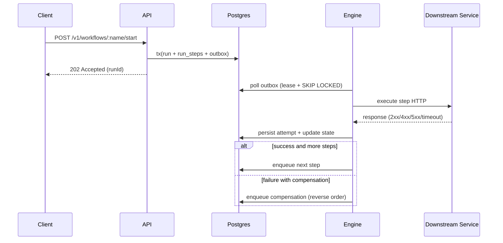

# SagaFlow

SagaFlow is a **Distributed Workflow / Saga Orchestrator** backend-only project built with Node.js + TypeScript.
It coordinates multi-step business workflows across HTTP services, with full PostgreSQL state persistence, safe retries, compensations, per-step idempotency, and observability-first design.

## What it solves

SagaFlow runs workflows such as:

`create order -> charge payment -> reserve inventory -> notify`

If a step fails, SagaFlow executes reverse-order compensations to preserve consistency (`refund`, `release inventory`, and others).

## Stack

- Node.js 20+
- TypeScript
- Fastify (API and mocks)
- PostgreSQL (critical state)
- Redis (admin rate limiting)
- Pino (logging)
- OpenTelemetry (tracing)
- Prometheus `/metrics`
- Vitest (unit + integration)
- Docker Compose
- GitHub Actions (CI)

## Architecture

```text
Client
  |
  v
[API Fastify] --(tx)--> [Postgres: runs/steps/outbox]
  |                              ^
  |                              |
  +------------------------------+
                                 |
                            polling + lease
                                 |
                            [Engine Worker]
                                 |
           +---------------------+----------------------+
           |                     |                      |
      [payments]            [inventory]          [notifications]
```

The engine runs as a separate service (`apps/engine`) and processes the outbox asynchronously.

### Sequence diagram



### Core principles

- No critical in-memory state.
- Outbox pattern for resilient asynchronous execution.
- `FOR UPDATE SKIP LOCKED` + leasing for safe multi-worker processing.
- Per-step idempotency via `X-Idempotency-Key`.
- Retries with exponential backoff + jitter.
- Reverse-order compensations.

## Delivery semantics

- Step execution: at-least-once.
- Compensation execution: at-least-once.
- Run state transitions: exactly-once per transition (transactional updates in Postgres).

## Failure model

SagaFlow is designed for partial failures and automatic recovery:

- If the engine crashes during a step:
  - the outbox row stays `IN_FLIGHT` with a lease.
  - after lease expiry, another worker resumes it.
  - per-step idempotency prevents duplicate side effects.
- If Postgres restarts:
  - API and engine fail readiness checks temporarily.
  - after recovery, the engine resumes from persisted outbox state.
- If a downstream service returns `5xx`:
  - the attempt is marked as transient failure.
  - a retry is scheduled using exponential backoff + jitter.
- If HTTP times out:
  - it is treated as retryable.
  - the attempt is stored in `step_attempts` and rescheduled by policy.
- If a process restarts during compensation:
  - pending compensation remains in outbox.
  - the next worker cycle continues from persisted state.

## Data model

Includes tables:

- `workflow_definitions`
- `workflow_runs`
- `run_steps`
- `step_attempts`
- `outbox`

Base migration: `migrations/sql/001_init.sql`.

How migrations run:

- Automatically when starting Docker Compose (the `migrate` service).
- Manually with `npm run migrate`.

## Main endpoints

### Orchestration

- `POST /v1/workflows/:name/start`
- `GET /v1/runs/:runId`
- `POST /v1/runs/:runId/steps/:stepId/retry`
- `POST /v1/runs/:runId/cancel`

### Admin

- `POST /v1/admin/workflows` (requires `X-Admin-Token`)

### Operations

- `GET /health`
- `GET /ready` (checks Postgres and Redis when Redis is configured)
- `GET /metrics`

## API examples (request/response)

### Start run

```bash
curl -X POST http://localhost:3000/v1/workflows/order-processing/start \
  -H "content-type: application/json" \
  -H "x-correlation-id: demo-readme-1" \
  -d '{
    "version": "1.0.0",
    "input": {
      "orderId": "o-1",
      "amount": 120,
      "sku": "sku-1",
      "email": "buyer@example.com"
    },
    "context": {
      "tenantId": "acme",
      "correlationId": "demo-readme-1"
    }
  }'
```

Expected response (`202 Accepted`):

```json
{
  "runId": "8d9b0f08-a6d8-4d59-bef2-39f89bc95d8e",
  "status": "PENDING"
}
```

### Get run status

```bash
curl http://localhost:3000/v1/runs/<RUN_ID>
```

Example response:

```json
{
  "run": {
    "runId": "8d9b0f08-a6d8-4d59-bef2-39f89bc95d8e",
    "workflowName": "order-processing",
    "workflowVersion": "1.0.0",
    "status": "COMPLETED",
    "error": null
  },
  "steps": [
    {
      "stepId": "charge-payment",
      "status": "SUCCEEDED",
      "attempts": 1,
      "compensationStatus": "PENDING"
    }
  ]
}
```

## Included demo workflows

- `order-processing@1.0.0`
  - `charge-payment` (comp: `refund-payment`)
  - `reserve-inventory` (comp: `release-inventory`)
  - `send-confirmation-email`
- `refund-flow@1.0.0`
  - `validate-refund`
  - `refund-payment`
  - `notify-customer`
- `invoice-issuance@1.0.0`
  - `create-invoice`
  - `emit-fiscal-doc`
  - `archive`

## Run locally

1. Copy environment variables:

```bash
cp .env.example .env
```

2. Start the stack:

```bash
docker compose up -d --build
```

3. Verify:

```bash
curl http://localhost:3000/health
curl http://localhost:3000/ready
curl http://localhost:3000/metrics
```

## Reproducible demos

Requires `jq` and `bash`.

### Success

```bash
bash scripts/demo-order-success.sh
```

### Failure + compensation

```bash
bash scripts/demo-order-fail-compensate.sh
```

## Observability

### Logs (Pino)

Includes: `correlationId`, `runId`, `workflowName`, `stepId`, state transitions, and retry scheduling.

### Metrics

- `workflow_runs_started_total`
- `workflow_runs_completed_total`
- `workflow_runs_failed_total`
- `workflow_runs_compensated_total`
- `workflow_run_duration_seconds{workflowName,status}`
- `workflow_active_runs`
- `step_attempts_total{stepId,status}`
- `step_retries_total{stepId,attemptType}`
- `step_latency_ms`
- `outbox_backlog_total`
- `outbox_lag_seconds`

### Tracing

- One span per HTTP request.
- One span per step execution and compensation.
- Attributes: `runId`, `stepId`, `attemptNo`, `http.status`.

## Basic security

- Admin endpoints protected with `X-Admin-Token`.
- Rate limiting on admin endpoints.
- Configurable sensitive-field log redaction (`LOG_SENSITIVE`).

## Quality and CI

CI (`.github/workflows/ci.yml`) runs:

- lint
- typecheck
- unit tests
- integration tests with Docker Compose
- demo scripts

## Useful scripts

- `npm run migrate`
- `npm run seed`
- `npm run dev:api`
- `npm run dev:engine`
- `npm run test`

## Technical decisions

- **Outbox**: guarantees recovery and continuation after engine crashes.
- **Leasing + SKIP LOCKED**: prevents duplicate processing in horizontal scaling.
- **Per-step idempotency**: minimizes duplicate side effects during retries.
- **Postgres state**: full traceability and replay-friendly execution.

## Naming and conventions

- Services: `sagaflow-api`, `sagaflow-engine`, `mock-payments`, `mock-inventory`, `mock-notifications`.
- Default ports:
  - API `3000`
  - Engine metrics/health `3100`
  - Payments `3001`
  - Inventory `3002`
  - Notifications `3003`
- Prometheus metric names grouped by workflow/outbox/step domain.
- OTEL tracing split by service for API vs engine span separation.

## Production readiness checklist

- [x] Critical state persisted in Postgres (no critical in-memory state).
- [x] Resilient asynchronous execution via outbox.
- [x] Safe multi-worker processing with locks/leases.
- [x] Retries with exponential backoff + jitter.
- [x] Reverse-order compensations on failures.
- [x] Metrics, logs, and tracing instrumentation.
- [x] CI with lint, typecheck, and tests.
- [x] Reproducible success and compensation demos.

## License

MIT. See `LICENSE`.

## Future work

- Visual workflow DSL.
- External signals/events per run.
- Cron/temporal steps.
- Real-time timeline UI.
- Dead-letter queue for failed outbox items.

## Known limits

- Designed for thousands of concurrent runs on standard setups.
- Not optimized for millions of long-lived workflows.
- Current actions are HTTP-only (no native gRPC support yet).
